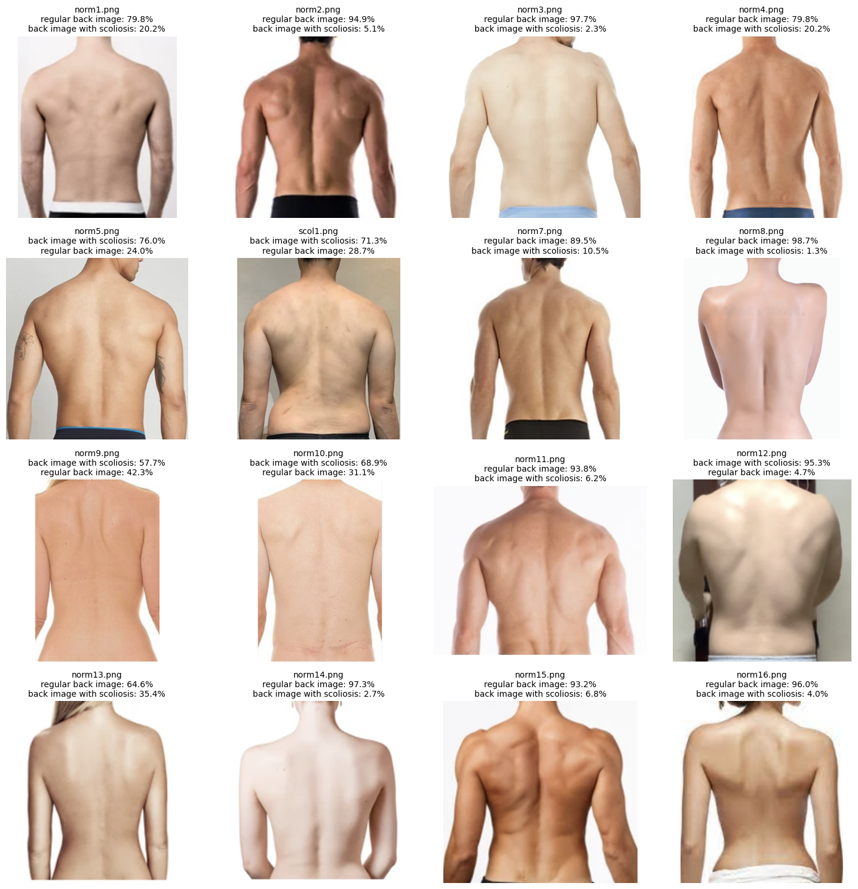
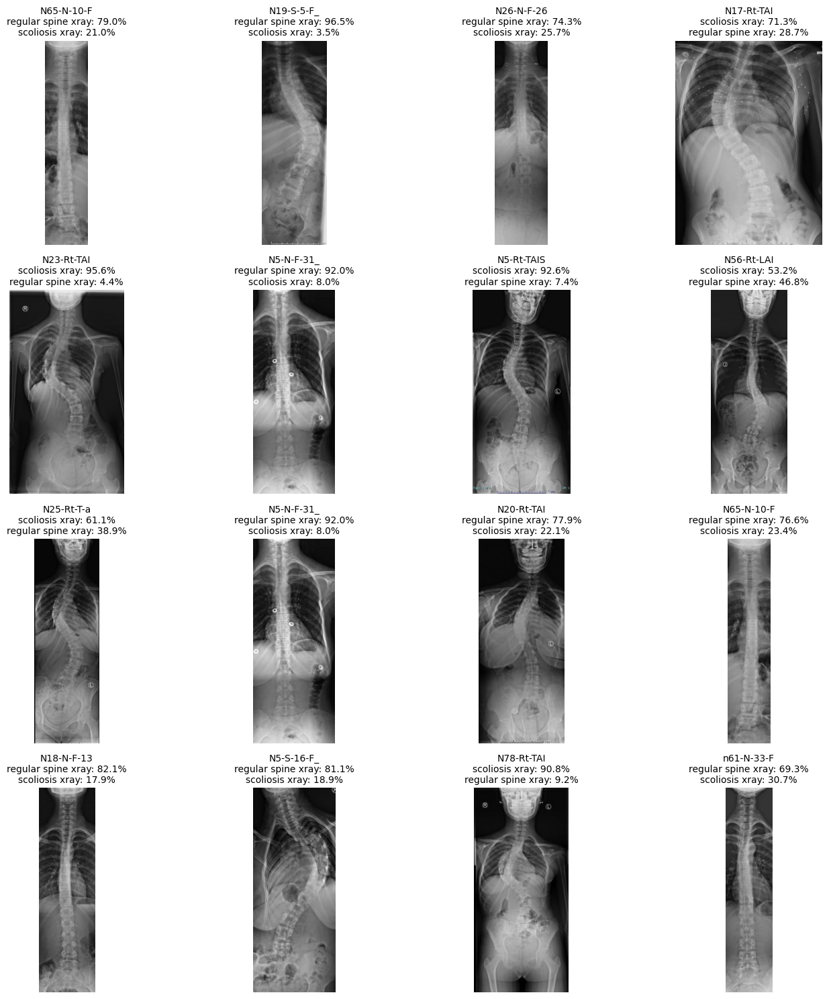

# SpineCARE

This project helps patients monitor cases of adolescent idiopathic scoliosis by offering a diagnosis prediction tool with 80% accuracy based on plain back images and 77% accuracy based on x-ray scans. It uses Microsoft's BioMedCLIP, which is a biomedical vision-language model trained on millions of figure-caption pairs extracted from biomedical research journals in PubMed Central.

### The Problem

Adolescent Idiopathic Scoliosis, AIS, is a sideways curvature of the spine that emerges during late childhood. This condition manifests significantly during adolescence, making time-sensitive treatment and early diagnosis crucial. Unfortunately, scoliosis screening has not been performed in Canadian schools for decades which means that many affected children are not aware of their conditions until it may be too late.

### Our Solution

Our app provides a cost-effective and easily accessible alternative to frequent hospital visits for the purpose of taking x-ray scans which can be both expensive and have adverse health effects in the long term.

